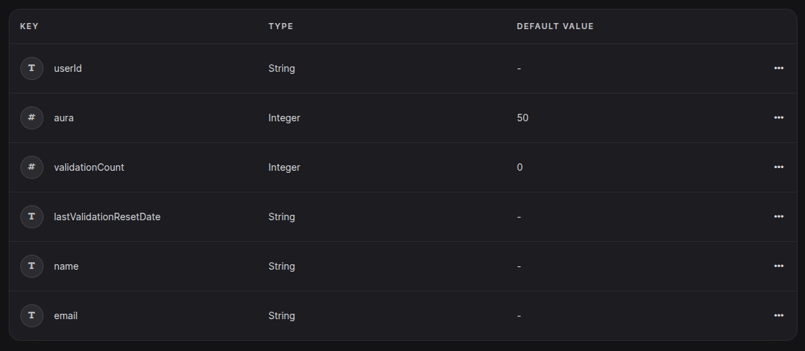

# AurAchieve-backend

> [!IMPORTANT]
> You're currently in the backend repository of AurAchieve, written in ExpressJS. To view the flutter frontend, please visit [this](https://github.com/NiceSapien/AurAchieve) repository instead.


**Fix your damn life.**

AurAchieve is the only self-improvement app you'll ever need. Earn Aura for every good thing you do. Prove it with AI, a timer, or just your honesty.

Get it now through [GitHub actions](https://github.com/NiceSapien/AurAchieve/actions).

## Self-hosting

You'll need NodeJS v20. You may be able to use newer versions but this backend was built and tested on `v20.19.0`. There are no "minimum" requirements for the backend, but it should be fine on 512MB RAM.

1. Clone the repository locally
2. Install all the packages and dependencies:

```bash
npm install
```

3. Setup a appwrite project. Enable JWT and email/password based auth. Create  a database, with the name `data` for example. Inside it, create 2 collections named `tasks` and `profiles`.  Add the following attributes into `tasks`:


Add the following in `profiles` and you'll be done:


4. Generate a API key with database and auth permissions from appwrite and copy it.


5. Download your AurAchieve Firebase project's admin sdk and drop it in a folder named(create new) `privateConfig/`

6. Edit `.env.example` according to the details inside it. Rename it to `.env` afterwards.


7. Run.

```bash
node server.js
```

## Contributing
Please ensure your contributions are compatible with the latest version of the app, but backwards compatibility is appreciated aswell. Follow the [Self-Hosting](#self-hosting) guide to get started!

There's not much about how to contribute yet. Here's how you may make commits:

`feat`: For new features

`improve`: For improvement of existing features

`fix`: For bug fixes

`delete`: For deleting something

`upgrade`: For upgrading/updating something, such as dependencies

`docs`: Anything related to documentation and not to the codebase itself

`refactor`: When refactoring some part of the codebase.

`security`: Anything related to the security and safety of the backend. These changes should be compatible with the latest version of the app.

## Sponsor AurAchieve
If you appreciate AurAchieve, please [sponsor](https://github.com/sponsors/NiceSapien) to keep AurAchieve free forever. You can also do this through [patreon](https://patreon.com/nicesapien), but GitHub sponsors is preferred over Patreon as it charges less. This repository could be locked under a sponsorship paywall. However, it is being provided free for everyone, forever. AurAchieve is even licensed under the most open MIT license.

More about sponsorships [here](https://github.com/nicesapien/aurachieve?tab=readme-ov-file#sponsors).