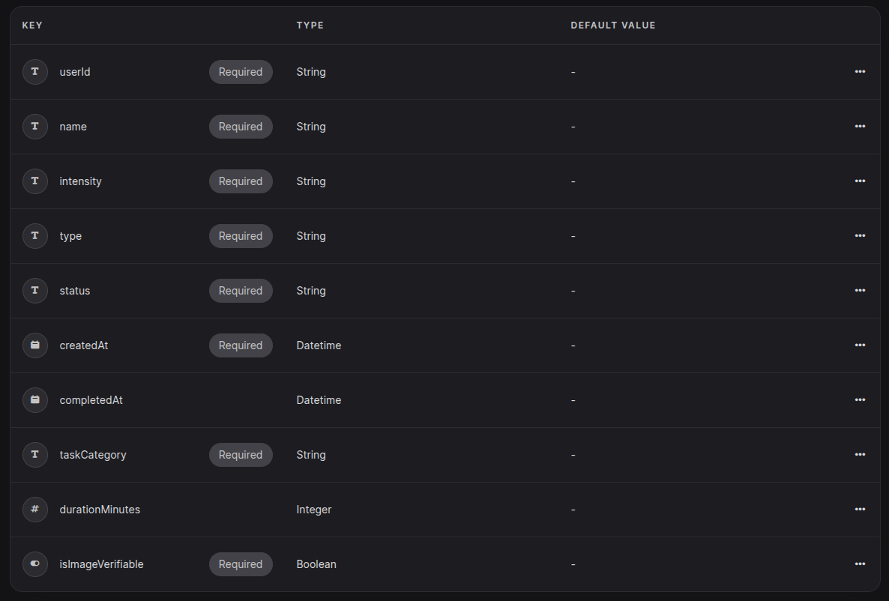

# AuraAscend-backend

> [!IMPORTANT]
> You're currently in the backend repository of AuraAscend, written in ExpressJS. To view the flutter frontend, please visit [this](https://github.com/NiceSapien/AuraAscend) repository instead.


**Fix your damn life.**

AuraAscend is the only self-improvement app you'll ever need. Earn Aura for every good thing you do. Prove it with AI, a timer, or just your honesty.

Get it now through [GitHub actions](https://github.com/NiceSapien/AuraAscend/actions).

## Self-hosting

1. Clone the repository locally
2. Install all the packages and dependencies:

```bash
npm install
```

3. Setup a appwrite project. Enable JWT and email/password based auth. Create  a database, with the name `data` for example. Inside it, create 2 collections named `tasks` and `profiles`.  Add the following attributes into `tasks`:



Add the following in `profiles` and you'll be done:


4. Generate a API key with database and auth permissions from appwrite and copy it.

5. Edit `.env.example` according to the details inside it. Rename it to `.env` afterwards.

6. Run.

```bash
node server.js
```

## Contributing
Please ensure your contributions are compatible with the latest version of the app, but backwards compatibility is appreciated aswell.

There's not much about contributing yet. Here's how you may make commits:

`feat`: For new features

`improve`: For improvement of existing features

`fix`: For bug fixes

`delete`: For deleting something

`upgrade`: For upgrading/updating something, such as dependencies

`docs`: Anything related to documentation and not to the codebase itself

`refactor`: When refactoring some part of the codebase.

`security`: Anything related to the security and safety of the backend. These changes should be compatible with the latest version of the app.

## Sponsor AuraAscend
If you appreciate AuraAscend, please [sponsor](https://github.com/sponsors/NiceSapien) to keep AuraAscend free forever. This repository could be locked under a sponsorship paywall. However, it is being provided free for everyone, forever. AuraAscend is even licensed under the most open MIT license.

More about sponsorships [here](https://github.com/nicesapien/auraascend?tab=readme-ov-file#sponsors)